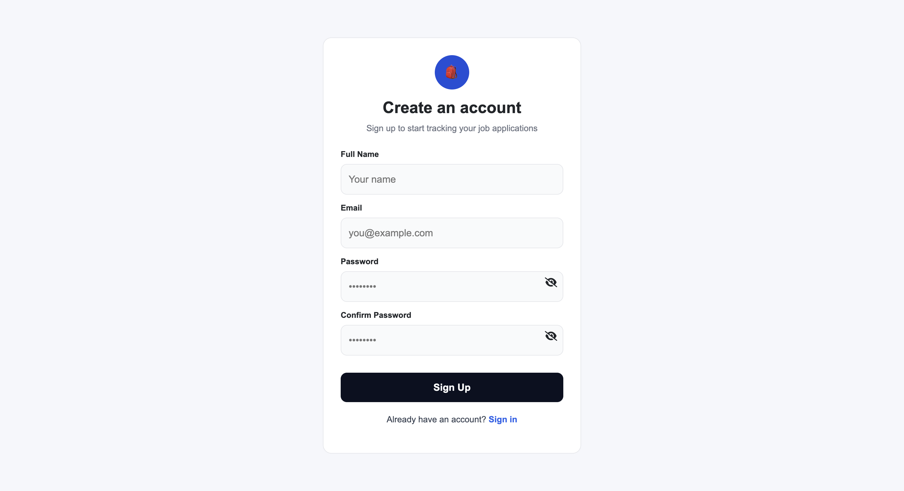
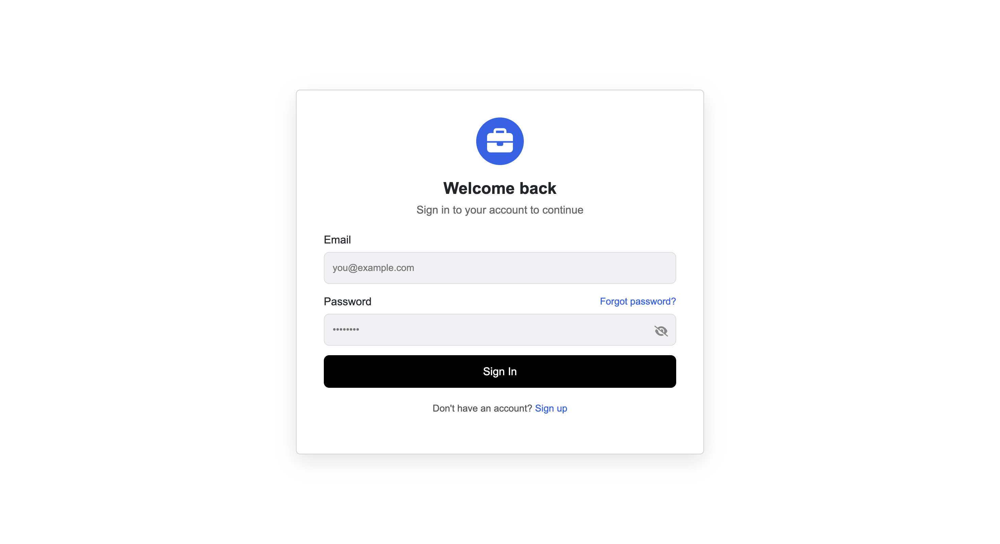
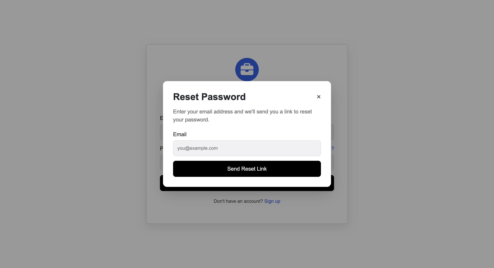
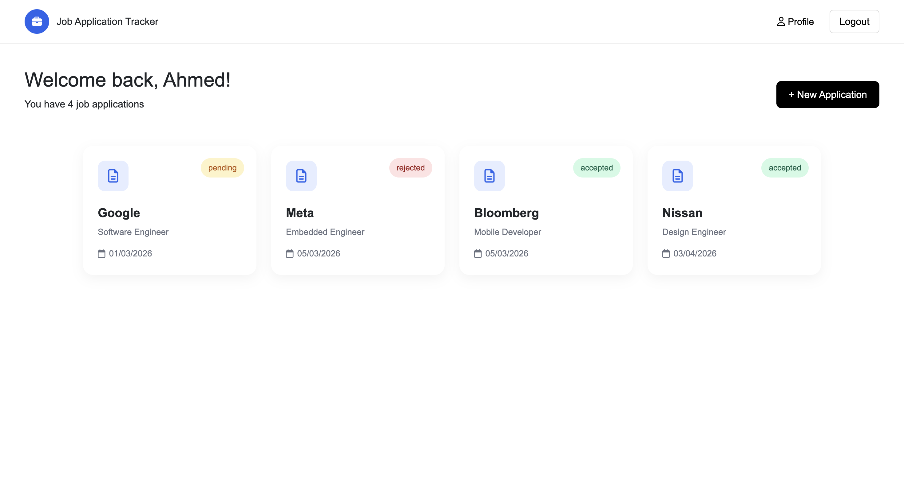
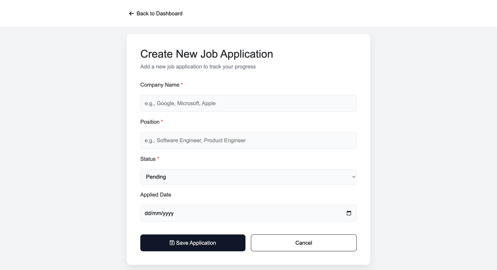
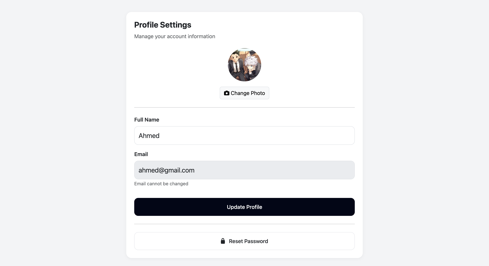
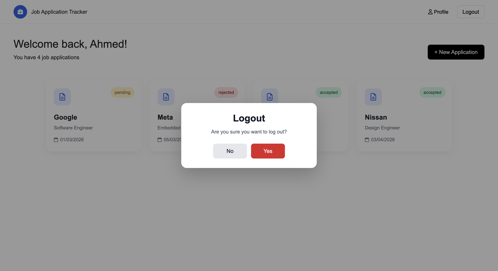

# Job Application Tracker

A full-stack web application to manage and track job applications, built with a strong focus on backend development using Java Spring Boot.

---

## 🚀 Features

- User authentication with JWT
- Secure password handling using BCrypt
- Create, update, delete job applications
- Track application status (Pending, Interview, Accepted, Rejected)
- Email-based password reset functionality
- RESTful API design
- Frontend integration with HTML, CSS, JavaScript

---

## 🛠️ Tech Stack

### Backend
- Java
- Spring Boot
- Spring Security
- JWT (JSON Web Token)
- Spring Data JPA (Hibernate)
- MySQL

### Frontend
- HTML
- CSS
- JavaScript
- Bootstrap

---

## 📂 Project Structure
**jobApplicationTracker/backend/jobtracker/src/main/java/com.ahmed.jobtracker**        **# Spring Boot application**

│   ├── controller/

│   ├── service/

│   ├── repository/

│   ├── entity/

│   ├── security/

**frontend/**       **# Static frontend**

│   ├── pages/

│   ├── js/

│   ├── css/

---

## 🔐 Authentication Flow

- User registers → password is hashed using BCrypt
- User logs in → receives JWT token
- Token is stored in localStorage
- All protected requests include: Authorization header with Bearer token

---

## ⚙️ How to Run the Project

### Backend
1. Open the backend in IntelliJ
2. Configure MySQL in `application.properties`
3. Run the Spring Boot application

### Frontend
1. Navigate to frontend folder
2. Run: npx http-server .
3. Open: http://localhost:8081/pages/login.html

---

## 📸 Screenshots

### 🔐 Login Page
### 🔐 Authentication

#### 📝 Registration

#### 🔑 Login

#### 🔁 Forgot Password

---

### 📊 Application Management

#### 📊 Dashboard

#### ➕ Create New Application

#### ✏️ Update / 🗑️ Delete Application

---

### 👤 User Features

#### 👤 Profile

#### 🚪 Logout

---

## 💡 About This Project

This project represents my personal implementation and learning journey in building full-stack applications with a backend-focused approach.

---

## 📌 Future Improvements

- Deploy application (AWS / Render / Docker)
- Add role-based authorization
- Improve UI/UX
- Add testing (JUnit)

---

## 👨‍💻 Author

Ahmed Darwish
